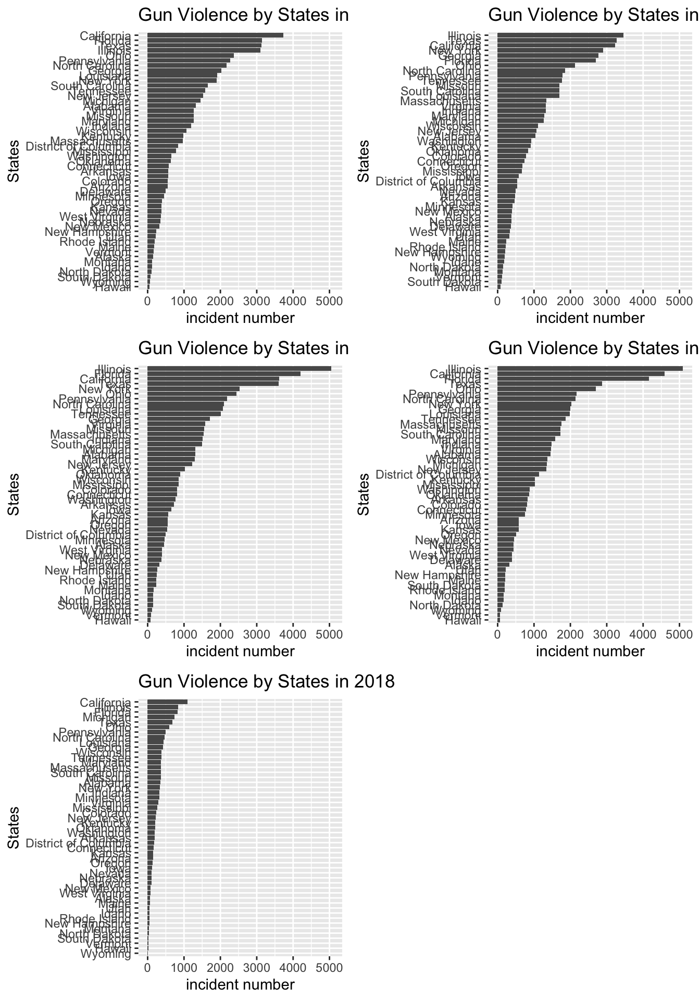

# Results

```{r setup, include=FALSE}
knitr::opts_chunk$set(echo = TRUE)
```

```{r include=FALSE}
library(ggplot2)
library(tidyverse)
library(stringr)
library(GGally)
library(parcoords)
library(tidyr)
library(r2d3)
library(dplyr)
library(ggmap)
library(maps)
library(mapdata)
library(readr)
library(gridExtra)
library(plotly)
```

```{r include=FALSE}
# read file
gun_vio=read.csv("../dataset/clean gun-violence-data_2013-3-2018-3.csv")
gun_vio["year"]=str_sub( as.character(gun_vio$date),1,4)
gun_vio<-gun_vio[which(as.numeric(as.character(gun_vio$year))>2013)  ,]
gun_vio$date<-as.Date(gun_vio$date)
gun_vio$state<-as.character(gun_vio$state)
gun_vio["year"]<-format(as.Date(gun_vio$date, format="%d/%m/%Y"),"%Y")
gun_vio["month"]<-format(as.Date(gun_vio$date, format="%d/%m/%Y"),"%m")

gun_vio_n <- read.csv("../dataset/gun_violence_sum.csv")
back_check=read.csv("../dataset/nics-firearm-background-checks copy.csv")
GDP<-read.csv("../dataset/GDP_states.csv")
GDP_sub<-GDP %>% select(-c(1,2,4,5,6,7,8,9))

gun_character <- read.csv("../dataset/gun-violence-character.csv")
#uem_month=read.csv("dataset/unemployment_states_by_month.csv")
population_tp=read.csv("../dataset/clean_population_by_state.csv")
population<-select(population_tp,2,3,4)

back_check$month<-as.character(back_check$month)
back_check["year"]=str_sub(back_check$month,1,4)

states_party<-read.csv("../dataset/states_party.csv")
```

## Exploring the Gun Violence Data

We start from an interesting question: Where is the least gun threaded state in the US? Then we would like explore the gun violence data, hoping to find the answers from sub questions. 

### How many gun violence incidents happened every year in each state?

We calculate the the sum of of incidents number of each state from 2014 to 2018, the plots are shown below, 
```{r include=FALSE}
#incident number
gun_vio_states<-gun_vio%>%
  group_by(state,year)%>%
  summarize(incident_number=n())
gun_vio_states<-as.data.frame(gun_vio_states)
gun_vio_states_2014 <- gun_vio_states %>%
  filter(year=="2014")
gun_vio_states_2015 <- gun_vio_states %>%
  filter(year=="2015")
gun_vio_states_2016 <- gun_vio_states %>%
  filter(year=="2016")
gun_vio_states_2017 <- gun_vio_states %>%
  filter(year=="2017")
gun_vio_states_2018 <- gun_vio_states %>%
  filter(year=="2018")

sum_2014 <- ggplot(gun_vio_states_2014 ,aes(x=fct_reorder(state,incident_number),y=incident_number))+
  geom_bar(position = "dodge", stat = "identity")+
  ylim(0,5100)+
  coord_flip()+
  ggtitle("Incident Number by States in 2015")+
  labs(y="incident number",x="States")

sum_2015 <- ggplot(gun_vio_states_2015 ,aes(x=fct_reorder(state,incident_number),y=incident_number))+
  geom_bar(position = "dodge", stat = "identity")+
  ylim(0,5100)+
  coord_flip()+
  ggtitle("Incident Number by States in 2015")+
  labs(y="incident number",x="States")

sum_2016 <- ggplot(gun_vio_states_2016 ,aes(x=fct_reorder(state,incident_number),y=incident_number))+
  geom_bar(position = "dodge", stat = "identity")+
  ylim(0,5100)+
  coord_flip()+
  ggtitle("Incident Number by States in 2016")+
  labs(y="incident number",x="States")

sum_2017 <- ggplot(gun_vio_states_2017 ,aes(x=fct_reorder(state,incident_number),y=incident_number))+
  geom_bar(position = "dodge", stat = "identity")+
  ylim(0,5100)+
  coord_flip()+
  ggtitle("Incident Number by States in 2017")+
  labs(y="incident number",x="States")

sum_2018 <- ggplot(gun_vio_states_2018 ,aes(x=fct_reorder(state,incident_number),y=incident_number))+
  geom_bar(position = "dodge", stat = "identity")+
  ylim(0,5100)+
  coord_flip()+
  ggtitle("Incident Number by States in 2018")+
  labs(y="incident number",x="States")
```

```{r,fig.height=16,fig.width=9 echo=FALSE, fig.width=9, r,fig.height=16}
grid.arrange(sum_2014,sum_2015,sum_2016,sum_2017,sum_2018,ncol=2)
```

The bar in 2018 is shorter than the bars in other years, it's because we only have the record from Jan to March in 2018. We could find that in 2014 and 2018, California has the most incident number; while in 2015, 2016 and 2017, Illinois has the most incident number. But, does the large number comes from the large population? Maybe it's better to calculate the incident number per 100000 person. The plots are shown below, 

```{r include=FALSE}
#incident number per 100000 person
gun_vio_adjust = merge(gun_vio_states,population, by.x=c("state", "year"), by.y=c("state", "year"))
gun_vio_adjust["incident_num_avg"]<-gun_vio_adjust$incident_number/gun_vio_adjust$population*100000
gun_vio_adjust<-select(gun_vio_adjust,1,2,5)

gun_vio_adjust_2014 <- gun_vio_adjust %>%
  filter(year=="2014")
gun_vio_adjust_2015 <- gun_vio_adjust %>%
  filter(year=="2015")
gun_vio_adjust_2016 <- gun_vio_adjust %>%
  filter(year=="2016")
gun_vio_adjust_2017 <- gun_vio_adjust %>%
  filter(year=="2017")
gun_vio_adjust_2018 <- gun_vio_adjust %>%
  filter(year=="2018")

avg_2014 <- ggplot(gun_vio_adjust_2014 ,aes(x=fct_reorder(state,incident_num_avg),y=incident_num_avg))+
  geom_bar(position = "dodge", stat = "identity")+
  ylim(0,170)+
  coord_flip()+
  ggtitle("Incident Number per 100000 person by States in 2014")+
  labs(y="average incident number",x="States")

avg_2015 <- ggplot(gun_vio_adjust_2015 ,aes(x=fct_reorder(state,incident_num_avg),y=incident_num_avg))+
  geom_bar(position = "dodge", stat = "identity")+
  ylim(0,170)+
  coord_flip()+
  ggtitle("Incident Number per 100000 person by States in 2015")+
  labs(y="average incident number",x="States")

avg_2016 <- ggplot(gun_vio_adjust_2016 ,aes(x=fct_reorder(state,incident_num_avg),y=incident_num_avg))+
  geom_bar(position = "dodge", stat = "identity")+
  ylim(0,170)+
  coord_flip()+
  ggtitle("Incident Number per 100000 person by States in 2016")+
  labs(y="average incident number",x="States")

avg_2017 <- ggplot(gun_vio_adjust_2017 ,aes(x=fct_reorder(state,incident_num_avg),y=incident_num_avg))+
  geom_bar(position = "dodge", stat = "identity")+
  ylim(0,170)+
  coord_flip()+
  ggtitle("Incident Number per 100000 person by States in 2017")+
  labs(y="average incident number",x="States")

avg_2018 <- ggplot(gun_vio_adjust_2018 ,aes(x=fct_reorder(state,incident_num_avg),y=incident_num_avg))+
  geom_bar(position = "dodge", stat = "identity")+
  ylim(0,170)+
  coord_flip()+
  ggtitle("Incident Number per 100000 person by States in 2018")+
  labs(y="average incident number",x="States")
```

```{r,fig.height=16,fig.width=9}
grid.arrange(avg_2014,avg_2015,avg_2016,avg_2017,avg_2018,ncol=2)
```

The resultes turns out very different, District of Columbia moves to the top of the bar from 2014 to 2018; Alaska becomes the second most in 2015 and 2016. It might because the population number in these states are quite small. 

### How many people get injured?

The gun violence may includes mass shooting. In every incident, the number of people who are injured or killed are different, we want to explore this number. The plot is shown below, 

```{r include=FALSE}

gun_vio_n_2014 <- gun_vio_n %>%filter(year=="2014")
gun_vio_n_2015 <- gun_vio_n %>%filter(year=="2015")
gun_vio_n_2016 <- gun_vio_n %>%filter(year=="2016")
gun_vio_n_2017 <- gun_vio_n %>%filter(year=="2017")
gun_vio_n_2018 <- gun_vio_n %>%filter(year=="2018")

sum_n_2014 <- ggplot(gun_vio_n_2014 ,aes(x=fct_reorder(state,total_TOLL),y=total_TOLL))+
  geom_bar(position = "dodge", stat = "identity")+
  ylim(0,5100)+
  coord_flip()+
  ggtitle("Injured Number by States in 2014")+
  labs(y="incident number",x="States")

sum_n_2015 <- ggplot(gun_vio_n_2015 ,aes(x=fct_reorder(state,total_TOLL),y=total_TOLL))+
  geom_bar(position = "dodge", stat = "identity")+
  ylim(0,5100)+
  coord_flip()+
  ggtitle("Injured Number by States in 2015")+
  labs(y="incident number",x="States")

sum_n_2016 <- ggplot(gun_vio_n_2016 ,aes(x=fct_reorder(state,total_TOLL),y=total_TOLL))+
  geom_bar(position = "dodge", stat = "identity")+
  ylim(0,5100)+
  coord_flip()+
  ggtitle("Injured Number by States in 2016")+
  labs(y="incident number",x="States")

sum_n_2017 <- ggplot(gun_vio_n_2017 ,aes(x=fct_reorder(state,total_TOLL),y=total_TOLL))+
  geom_bar(position = "dodge", stat = "identity")+
  ylim(0,5100)+
  coord_flip()+
  ggtitle("Injured Number by States in 2017")+
  labs(y="incident number",x="States")

sum_n_2018 <- ggplot(gun_vio_n_2018 ,aes(x=fct_reorder(state,total_TOLL),y=total_TOLL))+
  geom_bar(position = "dodge", stat = "identity")+
  ylim(0,5100)+
  coord_flip()+
  ggtitle("Injured Number by States in 2018")+
  labs(y="incident number",x="States")
```

```{r,fig.height=16,fig.width=9}
grid.arrange(sum_n_2014,sum_n_2015,sum_n_2016,sum_n_2017,sum_n_2018,ncol=2)
```

The bar in 2018 is shorter than the bars in other years, it's because we only have the record from Jan to March in 2018. We could find the pattern is quite similar to the pattern of incident number, Illinois has the largest number from 2015 to 2018; California has the largest number in 2014. Then we would like to look at the this number per 100000 person. The plots are shown below, 

```{r include=FALSE}
gun_vio_n_adjust = merge(gun_vio_n,population, by.x=c("state", "year"), by.y=c("state", "year"))

gun_vio_n_adjust['sum_killed_avg']<-gun_vio_n_adjust$total_TOLL/gun_vio_n_adjust$population*100000
gun_vio_n_adjust<-select(gun_vio_n_adjust,1,2,6)

gun_vio_adjust_2014 <- gun_vio_n_adjust %>%
  filter(year=="2014")
gun_vio_adjust_2015 <- gun_vio_n_adjust %>%
  filter(year=="2015")
gun_vio_adjust_2016 <- gun_vio_n_adjust %>%
  filter(year=="2016")
gun_vio_adjust_2017 <- gun_vio_n_adjust %>%
  filter(year=="2017")
gun_vio_adjust_2018 <- gun_vio_n_adjust %>%
  filter(year=="2018")


avg_n_2014 <- ggplot(gun_vio_adjust_2014 ,aes(x=fct_reorder(state,sum_killed_avg),y=sum_killed_avg))+
  geom_bar(position = "dodge", stat = "identity")+
  ylim(0,70)+
  coord_flip()+
  ggtitle("Injured Number per 100000 person by States in 2014")+
  labs(y="average incident number",x="States")

avg_n_2015 <- ggplot(gun_vio_adjust_2015 ,aes(x=fct_reorder(state,sum_killed_avg),y=sum_killed_avg))+
  geom_bar(position = "dodge", stat = "identity")+
  ylim(0,70)+
  coord_flip()+
  ggtitle("Injured Number per 100000 person by States in 2015")+
  labs(y="average incident number",x="States")

avg_n_2016 <- ggplot(gun_vio_adjust_2016 ,aes(x=fct_reorder(state,sum_killed_avg),y=sum_killed_avg))+
  geom_bar(position = "dodge", stat = "identity")+
  ylim(0,70)+
  coord_flip()+
  ggtitle("Injured Number per 100000 person by States in 2016")+
  labs(y="average incident number",x="States")

avg_n_2017 <- ggplot(gun_vio_adjust_2017 ,aes(x=fct_reorder(state,sum_killed_avg),y=sum_killed_avg))+
  geom_bar(position = "dodge", stat = "identity")+
  ylim(0,70)+
  coord_flip()+
  ggtitle("Injured Number per 100000 person by States in 2017")+
  labs(y="average incident number",x="States")

avg_n_2018 <- ggplot(gun_vio_adjust_2018 ,aes(x=fct_reorder(state,sum_killed_avg),y=sum_killed_avg))+
  geom_bar(position = "dodge", stat = "identity")+
  ylim(0,70)+
  coord_flip()+
  ggtitle("Injured Number per 100000 person by States in 2018")+
  labs(y="average incident number",x="States")
```

```{r,fig.height=16,fig.width=9}
grid.arrange(avg_n_2014,avg_n_2015,avg_n_2016,avg_n_2017,avg_n_2018,ncol=2)
```

This pattern is also similar to the pattern of incident number per 100000 person, District of Columbia is at the top of the bar chart from 2014 to 2018. 

### Where does these gun violence happen?

Then, we zoomed in the map to find the exact location of each gun incident. We ploted each event as a red dot on the map. The following plot shows the gun violence in California in 2013, 
```{r include=FALSE}
data <- read_csv("../dataset/gun-violence-data_01-2013_03-2018.csv")
names(data)[15] <- "lat"
names(data)[17] <- "lon"
data$date <- as.character(data$date)
data_new <- data %>%
  filter(state=="California")
data_new["year"]=str_sub( as.character(data_new$date),1,4)
data_new <- data_new %>%
  filter(year=="2013")
```

```{r,fig.height=6,fig.width=4}
qmplot(lon,lat,data=data_new,colour=I("red"),zoom=9,size = I(0.9),alpha=.3,maptype = "toner-lite",main = "Gun violence in California in 2013")+
  theme(legend.position="none")
```

As we could see from this plot, the gun violence incident is clustered at cities and roads, which means that gun violences is mostly happen where people are. 

Then we separated the US into two parts by Democratic Party and Republican Party. Does the gun violence has something to do the party. We used boxplot trying to answer this question. The boxplots are shown below, 

```{r include=FALSE}
gun_vio_n_adjust = merge(gun_vio,population, by.x=c("state", "year"), by.y=c("state", "year"))

gun_vio_n_adjust['sum_killed_avg']<-(as.numeric(as.character(gun_vio_n_adjust$n_killed))+ as.numeric(as.character(gun_vio_n_adjust$n_injured)) )/as.numeric(as.character(gun_vio_n_adjust$population))*100000
gun_vio_n_adjust<-select(gun_vio_n_adjust,1,2,3,10,11,12)

gun_vio_n_adjust<-select(gun_vio_n_adjust,-3)
gun_vio_n_adjust_group<-gun_vio_n_adjust%>%
  group_by(year,month,state)%>%
  summarize("sum_killed_avg"=sum(sum_killed_avg))
gun_vio_n_adjust_group<-as.data.frame(gun_vio_n_adjust_group)
gun_vio_n_adjust_group_mrg<-merge(gun_vio_n_adjust_group,states_party,by.x='state',by.y='State')

library(plotly)
p <- plot_ly(gun_vio_n_adjust_group_mrg, y = ~sum_killed_avg, color = ~Parties, title="Gun Violence by Parties",colors = c('blue',  'red'),type = "box") %>%
  layout(title="Boxplot of people killed/injured per 100,000 person by Party")
```

```{r}
p
```

In the above plot, each dot represents a state, y-axis represents the average number of people who get injured or killed of each state. The boxplots give us very interesting information. There are many outliers in Democratic Party, but the average number in Democratic Party states is lower than the states in Republican Party. 

### Which kind of gun violence is the most common?

Then, we look at the type of each incident, which is represented by key characteristics of gun violence incidents. We sum the same kind of incidents from 2014 to 2018 in every state, the plot is shown below, 

```{r include=FALSE}
character<-gun_character
character['Mass Shooting']<-str_detect(character$incident_characteristics,'Mass Shooting')
character['Shot_Wounded/Injured']<-str_detect(character$incident_characteristics,'Shot - Wounded/Injured')
character['Shot_Dead (murder, accidental, suicide)']<-str_detect(character$incident_characteristics,'Shot - Dead')
character['Possession (gun(s) found during commission of other crimes)']<-str_detect(character$incident_characteristics,'found during commission of other crimes')
character['Possession of gun by felon or prohibited person']<-str_detect(character$incident_characteristics,'Possession of gun by felon or prohibited person')
character['Drug involvement']<-str_detect(character$incident_characteristics,'Drug involvement')
character['Shots Fired']<-str_detect(character$incident_characteristics,'Shots Fired')
character['Bar/club incident - in or around establishment']<-str_detect(character$incident_characteristics,'Bar/club incident - in or around establishment')
character['Armed robbery with injury/death and/or evidence of DGU found']<-str_detect(character$incident_characteristics,'Armed robbery with injury/death and/or evidence of DGU found')
character['Shot - Dead (murder, accidental, suicide)']<-str_detect(character$incident_characteristics,'Dead')
character['Officer Involved Shooting']<-str_detect(character$incident_characteristics,'Officer Involved Shooting')
character['Kidnapping/abductions/hostage']<-str_detect(character$incident_characteristics,'Kidnapping/abductions/hostage')
character['Brandishing/flourishing/open carry/lost/found']<-str_detect(character$incident_characteristics,'Brandishing/flourishing/open carry/lost/found')
character['Murder/Suicide']<-str_detect(character$incident_characteristics,'Murder/Suicide')
character['Drug involvement']<-str_detect(character$incident_characteristics,'Drug involvement')
character['Drive-by (car to street, car to car)']<-str_detect(character$incident_characteristics,'(car to street, car to car)')
character['Defensive Use']<-str_detect(character$incident_characteristics,'Defensive Use')
character['Domestic Violence']<-str_detect(character$incident_characteristics,'Domestic Violence')
character['Home Invasion']<-str_detect(character$incident_characteristics,'Home Invasion')
character['Institution/Group/Business']<-str_detect(character$incident_characteristics,'Institution/Group/Business')
character['Concealed Carry License - Perpetrator']<-str_detect(character$incident_characteristics,'Concealed Carry License - Perpetrator')
character['School Shooting']<-str_detect(character$incident_characteristics,'School Shooting')
character['Car-jacking']<-str_detect(character$incident_characteristics,'Car-jacking')
character['Hate crime']<-str_detect(character$incident_characteristics,'Hate crime')
character['House party']<-str_detect(character$incident_characteristics,'House party')
character['Workplace shooting']<-str_detect(character$incident_characteristics,'Workplace shooting')
character['Gun(s) stolen from owner']<-str_detect(character$incident_characteristics,'Gun(s) stolen from owner')
character['Accidental/Negligent Discharge']<-str_detect(character$incident_characteristics,'Accidental/Negligent Discharge')
character['Accidental Shooting']<-str_detect(character$incident_characteristics,'Accidental Shooting')
character['ATF/LE Confiscation/Raid/Arrest']<-str_detect(character$incident_characteristics,'ATF/LE Confiscation/Raid/Arrest')
character['Non-Shooting Incident']<-str_detect(character$incident_characteristics,'Non-Shooting Incident')
character['Shots Fired - No Injuries']<-str_detect(character$incident_characteristics,'Shots Fired - No Injuries')
character=select(character,-1)
character_sum<-colSums(character[,-1])
character_sum_df_tp<-as.data.frame(as.list(character_sum))
character_sum_df<-gather(character_sum_df_tp)
```

```{r,fig.width=6}
character_sum_df%>%filter(value>1000)%>%
ggplot(aes(x= fct_reorder(key, value)   ,y=value))+
  geom_bar(position = "dodge", stat = "identity")+
  coord_flip()+
  ggtitle("Key characteristics")+
  xlab("key characteristics")
```

From the plot above, we could find that there are many different types of incidents. The most common type of incident is  shot-wounded/injured, the second commen type of is shot-murder. 

### When does gun violence happen?

Then we would like to explore the data in time series. Does the gun viooence incidents are more likely to happen in sepcific time? we plot each gun violence incident by time from 2014 to 2018, 

```{r include=FALSE}
gun_vio$n_killed<-as.numeric(as.character(gun_vio$n_killed))
gun_vio$n_injured<-as.numeric(as.character(gun_vio$n_injured))
gun_vio<-gun_vio%>%
  filter(!is.na(n_killed) | !is.na(n_injured))
gun_vio_day<-gun_vio%>%
  group_by(date,year)%>%
  summarize('incident_number'=n(),'sum_killed'=sum(n_killed),'sum_injured'=sum(n_injured))
gun_vio_day <- gun_vio_day %>%
  filter(!is.na(sum_killed) | !is.na(sum_injured))
gun_vio_day<-as.data.frame(gun_vio_day)
gun_vio_day$date<-as.character(gun_vio_day$date)
gun_vio_day["month"]=str_sub(gun_vio_day$date,6,7)
gun_vio_day$date<-as.Date(gun_vio_day$date)
gun_vio_day_new<-gun_vio_day%>%
  group_by(year,month)%>%
  summarize('incident_number'=sum(incident_number),'sum_killed'=sum(sum_killed),'sum_injured'=sum(sum_injured))
gun_vio_day_new["adjusted_date"]<-as.Date( str_c(gun_vio_day_new$year,"-",gun_vio_day_new$month,"-15")  )

p <- plot_ly(gun_vio_day_new, x = ~adjusted_date, y = ~incident_number, name = 'incident_number', type = 'scatter', mode = 'lines') %>%
  add_trace(y = ~sum_killed, name = 'sum_killed', mode = 'lines+markers') %>%
  add_trace(y = ~sum_injured, name = 'sum_injured', mode = 'lines')

```

```{r,fig.width=8}
p
```

The above plot shows the sum of incident number, number of killed and number of injured of each month from 2014 to 2018. We could find that there are some peaks in this plot. We are very surprised to find that peaks are always in summer, in june and August. We guessed that it might because people are easy to lose their mind when it's hot. 

## Effects of Gun Possesion

Since the numbers of firearm possesions are different among states, it might have something to do with the gun violence. 

### How does the gun change rate influence the gun violence status?

## Effects of GDP data

We also would like to find whether there is something to do with the ecnomic situation. We choosed to use GDP of each state to represent the economic situation. We extracted the GDP of the United States of year 2017 and the incident number of each state in 2017. In the scatterplot, each dot is a state, x-axis is GDP of this state, y-axis is incident of this state. 

```{r include=FALSE}
GDP_2017 <- GDP_sub %>%
  select(1,23)
gun_vio_n_2017 <- gun_vio_n %>%
  filter(year=="2017")
GDP_2017 <- merge(GDP_2017,gun_vio_n_2017,by.x = "GeoName",by.y = "state")
GDP_2017_plot <- plot_ly(data = GDP_2017, x = ~X2017, y = ~total_TOLL,
        marker = list(size = 10,
                       color = 'rgba(255, 182, 193, .9)',
                       line = list(color = 'rgba(152, 0, 0, .8)',
                                   width = 2))) %>%
  layout(title = 'GDP-incident number-2017',
         yaxis = list(zeroline = FALSE),
         xaxis = list(zeroline = FALSE))
```

```{r}
GDP_2017_plot
```

## Combining these variables

Now, we introduced gun violence data, background check data as well as GDP data. How do these variabled combine with each other? We use parallel coordinates charts to show their relations.

```{r include=FALSE}
Parcoord<-function(year)
{
  year<-as.character(year)
  back_check_year<-back_check[ which(back_check$year==year), ]
  back_check_state<-back_check_year%>%
    group_by(year,state)%>%
    summarize(total_year=sum(totals))
  
  gun_vio$date<-as.Date(gun_vio$date)
  gun_vio_tp<-gun_vio[which( format(as.Date(gun_vio$date, format="%d/%m/%Y"),"%Y")==year), ]
  gun_vio_tp<-subset(gun_vio_tp,select=c("date","state","n_killed","n_injured"))
  gun_vio_tp["n_sum"]<-as.numeric(gun_vio_tp$n_killed)+as.numeric(gun_vio_tp$n_injured)
  gun_vio_state<-gun_vio_tp%>%
    group_by(state)%>%
    summarize(n=sum(n_sum))

  check_vio<-merge(back_check_state, gun_vio_state, by.x="state", by.y="state")
  
  # uem_month$State<-str_trim(uem_month$State)
  # uem_rate<-uem_month[which(uem_month$Year==year), ]
  # uem_rate$State<-str_trim(uem_rate$State)
  
  GDP_year<-subset(GDP,select=c("GeoName",str_c("X",year)))
  
  colnames(GDP_year)<-c("state","GDP_total")
  population$year<-as.character(population$year)
  population_sub<-population[which(population$year==year),]
  GDP_avg=merge(GDP_year,population_sub,by.x="state",by.y="state")
  GDP_avg["GDP_avg"]=GDP_avg$GDP_total*1000000/GDP_avg$population
    
  check_vio_uem<-merge(check_vio, GDP_avg, by.x="state", by.y="state")

  colnames(check_vio_uem)<-c("state","year","checking_totals","gun_violence_death","GDP_total","Year", "population",  "GDP_avg")
  
  check_vio_uem<-check_vio_uem%>%
    filter(!is.na(gun_violence_death))
  
  parcoords(check_vio_uem[c("state","checking_totals","gun_violence_death","GDP_avg")],rownames = FALSE,reorder = TRUE, brushMode="1D",alpha = .3, color = list(colorScale = "scaleOrdinal",colorBy = "state", colorScheme = "schemeCategory10"), withD3 = TRUE)
}
```

```{r}
Parcoord("2014")
```

From this plot of year 2014, we could find that most lines are at the bottom of this plot. Kentucky has the largest number of background check, while Illinois and California has the largest number of death. 

```{r}
Parcoord("2015")
```

```{r}
Parcoord("2016")
```

```{r}
Parcoord("2017")
```
